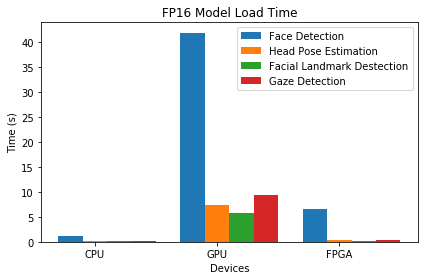
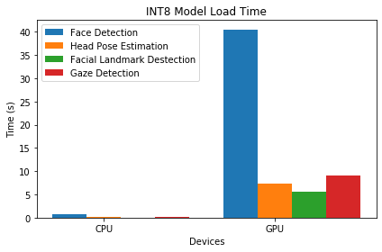
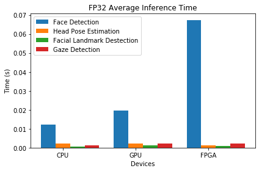
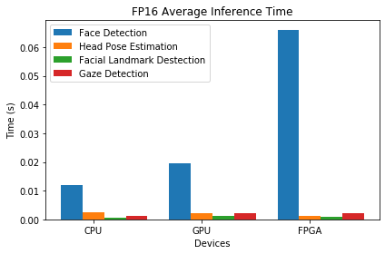
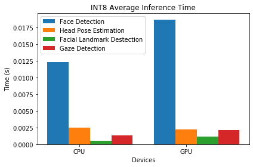
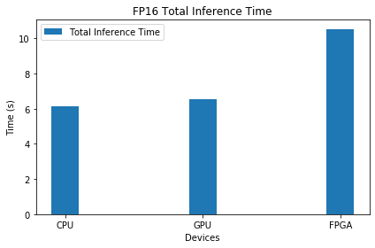
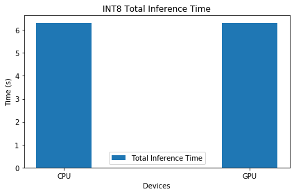
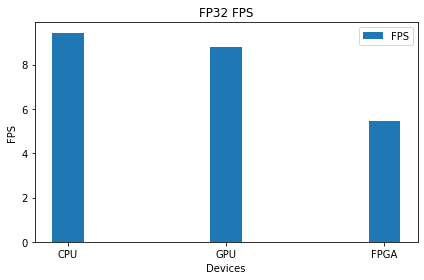
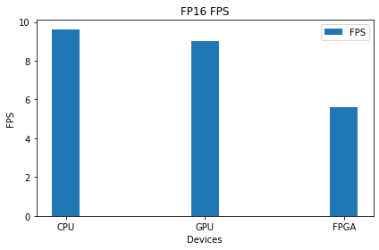
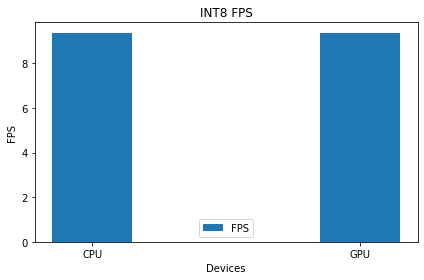

# Computer Pointer Controller
This project demonstrate the ability to use Intel OpenVino IR model to control computer's pointer. In this project, 4 IR model are utilized. The inference pipeline is showns below


The input images comes from video, image, or webcam. This project also ultized PyAutoGui to control the pointer as the inference result. You also need Intel OpenVino R3.1 or later.

## Project Set Up and Installation
*TODO:* Explain the setup procedures to run your project. For instance, this can include your project directory structure, the models you need to download and where to place them etc. Also include details about how to install the dependencies your project requires.

### Supported Hardwares
To able run the application, your system should meet at least one of the following hardwares.

- 6th gen Intel Core family processor
- Intel Xeon processor
- Intel Xeon E family
- Intel Atom processor with support for Intel SSE4.1
- Intel Pentium processor N4200/5, N3350/5, or N3450/5 with Intel HD Graphic
- Intel FPGA
- Intel Movidious VPU

### Supported OS
- Windows 10 (not tested)
- Ubuntu 18.04 LTS (64bit)
- CentOS (not tested)
- macOS 10.13 (not tested)

### Dependencies
- image==1.5.27
- ipdb==0.12.3
- ipython==7.10.2
- numpy==1.17.4
- Pillow==6.2.1
- requests==2.22.0
- virtualenv==16.7.9

### Install Dependencies
`$ pip install -r requirements.txt`


### Models Directory
By default this project using the following models

- face-detection-adas-binary-0001
- head-pose-estimation-adas-0001
- landmarks-regression-retail-0009
- gaze-estimation-adas-0002

If you want to use other models, please put it to `models` directory.

for example:
```
models/<your_models>/<precision>/your_model.xml
models/<your_models>/<precision>/your_model.bin
```

You also need to update the `src/constant.py` to follow your models directory


## Demo
Go to `src` directory and run this command
`$ python main.py -it video -if ../bin/video -p FP32 -l <path to CPU extension>`

If you use OpenVino 2020.1 or later
`$ python main.py -it video -if ../bin/video -p FP32`


## Documentation
```
usage: main.py [-it] [-if] [-d] [-l] [-p]

General:
    -h, --help          show the help

arguments:
    -it, --input_type   project input type. It can be video, image, or webcam
    -if, --input_file   directory of input file. This is required for video and image
    -d, --device        the device to infer on. CPU, GPU, MYRIAD, FPGA
    -l, --cpu_extension the path to cpu extension. Required for OpenVino 2019 and older
    -p, --precision     model precision option. FP32, FP16, or INT8

example:
    main.py -it video -if video.mp4 -p FP32
    main.py -it video -if video.mp4 -d CPU -l libcpu_extension_sse4.so -p FP32
```

## Benchmarks
Intel DevCloud for Edge were utilized to perform model benchmarking. In this case, we use Intel Core i5 6500TE as CPU device, Intel HD Graphics 530 as GPU device, and Intel® Arria® 10 FPGA as FPGA device. We use the following matric to compare the performance :

- Model load time (for each model)
- Average inference time (for each model)
- Total inference time
- FPS

We also perform benchmarking in different level of precision, which are FP32, FP16, and INT8. However, FPGA device only support FP32 and FP16 precision model, therefore we only perform benchmarking on these precision. 

__*NOTES: During benchmarking, we didn't show the output frames and mouse controller didn't performed.*__

### Model Load Time
  

### Average Inference Time
  

### Total Inference Time
  

### FPS
  

## Results
The result shows CPU outperforming the other devices in every matrics. As expected, GPU was the slowest device to load model, especially face detection model. Therefore, GPU shows fair result on average inference time, total inference time, and FPS number. Moreover, we can see that the average inference time for each model, INT8 precision shows outstanding result. INT8 only took about 12.5 ms on CPU and 17.5 ms on GPU. This result automatically will be affect the total inference time. INT8 also generate fair number of FPS comparing to FP16 and FP32. 

## Stand Out Suggestions
The project assume that all the model running on the same device. Therefore, it perhaps not the best solution. We can do inference in the different device depends on conditions or priority. We can perform quatization metode on face detection model. According to the result, face detection model shows a heavy duty task, thus we need to do some enhancement. Moreover, we also can use another model for face detection to get better result, since the the model from IR model zoo only provide FP32-INT1 precision. Its mean it won't work with VPU.

### Async Inference
This project utilized async inferece as the default inference methods. We use async method because the ability to perform multiple inference at the same time. This method will result the better result comparing to synchronous inference. In synchrounous inference, the inference request need to be waiting until the other inference request executed. Therefore, it more suitable to use async inference in this project. 

### Edge Cases
This project demonstrate the ability to use human gaze to control computer mouse. However, there are some limitations. The first, this project only work better if only one person has been detected. In the real condition, if we use webcam, we should deal with other detected person. To deal with condision, we suggest to detect the main person only. We asume that the main person is the person who have largest area in the frame. The second problem is screen ratio. We need to calibrate the screen area to make cursor move more precise, thus the project can adapt every screen ratio.
